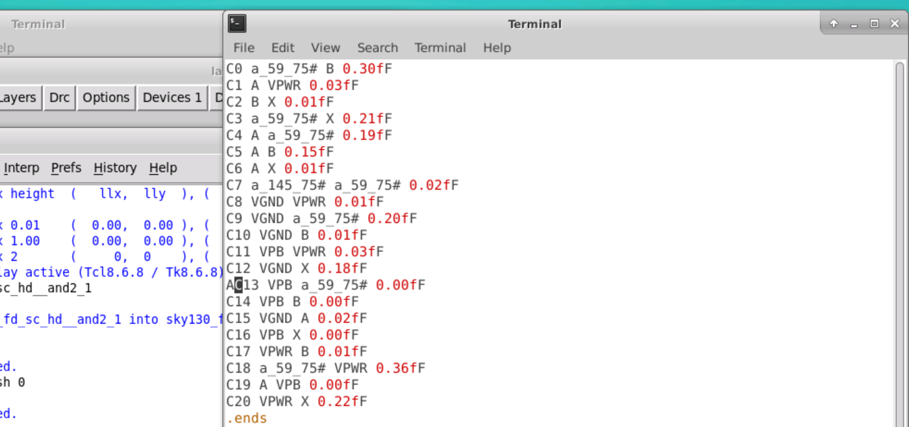

# PDK-skywater130
Physical verification using skywater130nm technology

## Inverter


Tools Installation and basic DRC/LVS design Flow:
1. Magic : 

 
2. Netgen :

 
3. xschem : 

 
4. ngspice : 

 


## Creating Sky130 device layout in magic: 

Setup commands : 

 

```
ln -s /usr/share/pdk/sky130A/libs.tech/xschem/xschemrc
ln -s /usr/share/pdk/sky130A/libs.tech/ngspice/spinit .spiceinit
ln -s /usr/share/pdk/sky130A/libs.tech/magic/sky130A.magicrc .magicrc

```
Now test the setups :
### 1. xschem
```
cd ../xschem
xschem
```

 
 This has lot of example schematics and it introduces you to sky130 devices.
 
 

 e4 -> enter into specific block
 
 ctrl + e -> exit
 
 ### 2. magic
```
cd ../mag
magic
magic -d XR (enhanced)
```

## Creating Simple schematic in xschem: 

```
cd ../xschem
xschem
```
Go to file -> new schematic (ctrl+n)

Press *insert* key on keyboard


Select nfet_01v8.sym


Select pfet3_01v8.sym


Now go back to library and select devices :
### Some useful commands: 
1. If you want to move nfet or pfet press m keyword.
2. If you want to copy press c.
3. delete key to delete component.
4. w key to wire up as shown in diagram below

We need to select 4 : 
1. ipin.sym
2. opin.sym
3. iopin.sym (2)


Now we need to change values of nfet and pfet for the inverter 
Press right click on nfet
### For nfet


### For pfet


## Creating Symbol and exporting schematic in xschem: 
1. Go to symbols
2. Make symbols from schematic
New schematic -> library -> open inverter.sym -> click ok

Now insert devices/vsource.sym
insert gnd.sym


 
 Create pins for signals in ngspice output
 opin.sym
 Connect as shown and change in out name.
 Now change voltages 


insert devices/codeshown.sym
and change 1st blabla value to value = ".lib /usr/share/pdk/sky130A/libs.tech/ngspice/sky130.lib.spice tt"
and 2nd codeshown value to value = ".control
tran 1n 1u
plot V(in) V(out)
.endc"


Now save file as inverter_tb.sch

After this click on netlist and then simulation
It will display plot of input vs output


Now the circuit is functionally validated through simulation, now we are ready for layout


Now file -> open -> inverter.sch -> click ok

Now Go to simulation  -> LVS netlist checked.
Click on netlist
and then quit.
That's all for xschem.


## Importing Schematic To Layout and Inverter Layout Steps

```
cd ../mag
magic -d XR
```

Go to file 
Import spice
Go to xchem -> open inverter.spice


V key press to get full view


**i to select the block and m to move it and s to select below blocks**
i and then ctrl+p (paramaters) 
for pfet
select top guard ring via coverage and type 100.
source via coverage = 40
drain via coverage = -40

for nfet
bottom guard ring via coverage = 100
source via covergae = +40
drain via coverage = -40


```
extract do local
extract all
ext2spcie lvs
ext2spice
quit
```


now 

```
cd ../netgen
netgen -batch lvs "../mag/inverter.spice inverter" "../xschem/inverter.spice inverter"
```


# GDS read write, extraction,DRC,LVS and XOR setup

## 1. GDS read
```
mkdir lab
cd lab
mkdir mag
cd mag
cp /usr/share/pdk/sky130A/libs.tech/magic/sky130A.magicrc ./.magicrc
magic -d XR
```
 
After the console :


```
gds read /usr/share/pdk/sky130A/libs.ref/sky130_fd_sc_hd/gds/sky130_fd_sc_hd.gds
cellname top

```
Go to cell manager -> will get a scrollable list 

and select and_2_1


now back in terminal write
```
cif istyle sky130(vendor)
gds read /usr/share/pdk/sky130A/libs.ref/sky130_fd_sc_hd/gds/sky130_fd_sc_hd.gds
```


## 2. Ports
in tkcon terminal
```
port index
port first
lef read /usr/share/pdk/sky130A/libs.ref/sky130_fd_sc_hd/lef/sky130_fd_sc_hd.lef
port 1 name
readspice /usr/share/pdk/sky130A/libs.ref/sky130_fd_sc_hd/spice/sky130_fd_sc_hd.spice

```


## 3. Abstract Views


```
load test
getcell sky130_fd_sc_hd__and2_1
```

select - s
expand - x


```
save test
quit
```


again magic -d XR
load test
press s and x
path
gds write test


## 4. Basic Extraction

```
magic -d XR
load sky130_fd_sc_hd__and2_1
extract all
ext2spice lvs
ext2spice
ext2spice cthresh 0
ext2spice
```


```
ext2sim labels on
ext2sim
```

now run these
```
extresist tolerance 10
extresist
```

Now we will do

```
ext2spice lvs
ext2spice cthresh 0.01
ext2spice extresist on
ext2spice

```


## 5. Setup for DRC


```
/usr/share/pdk/sky130A/libs.tech/magic/run_standard_drc.py /usr/share/pdk/sky130A/libs.ref/sky130_fd_sc_hd/mag/sky130_fd_sc_hd__and2_1.mag

magic -d XR
load sky130_fd_sc_hd__and2_1
```

```
load test2
getcell sky130_fd_sc_hd__and2_1
getcell sky130_fd_sc_hd__tapvpwrvgnd_1
```


save test3

## 6. Setup for LVS

```
mkdir netgen 
cd netgen
cp /usr/share/pdk/sky130A/libs.tech/netgen/sky130A_setup.tcl ./setup.tcl
cd ../mag
magic -d XR sky130_fd_sc_hd__and2_1
```


```
ext2spice lvs
ext2spice
quit
cd ../netgen
netgen -batch lvs "../mag/sky130_fd_sc_hd__and2_1.spice sky130_fd_sc_hd__and2_1" "/usr/share/pdk/sky130A/libs.ref/sky130_fd_sc_hd/spice/sky130_fd_sc_hd.spice sky130_fd_sc_hd__and2_1"

```


## 7. Setup for XOR

```
cd ../mag
magic -d XR
load sky130_fd_sc_hd__and2_1
save altered
load altered
erase li
flatten -nolabels xor_test
load sky130_fd_sc_hd__and2_1
xor -nolabels xor_test
load xor_test
quit
magic -d XR
load test3
flatten -nolabels xor_test

xor -nolabels xor_test
load xor_test
```


# DRC rules
